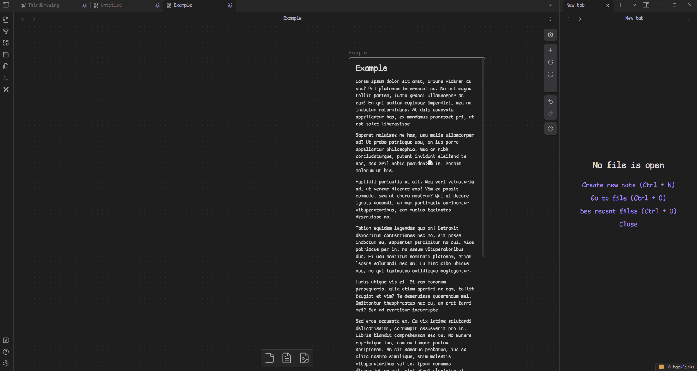
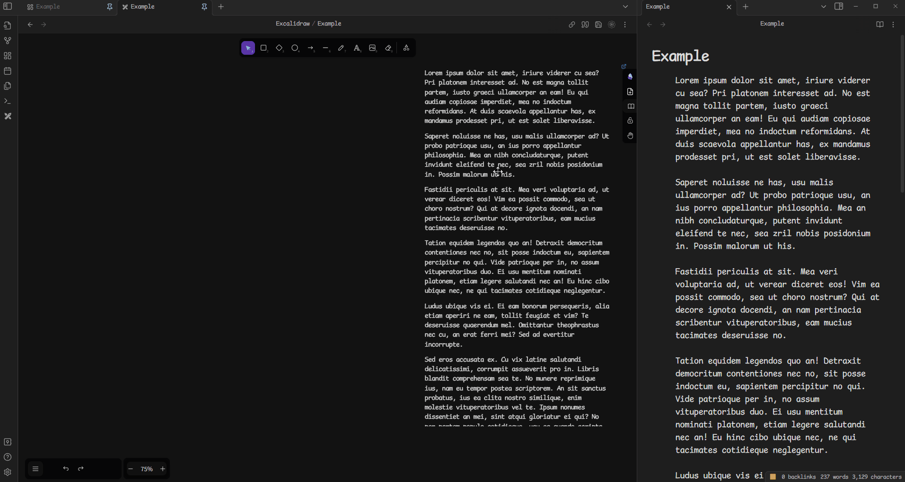

# CardNote
此工具將創建筆記及在圖像化工具中插入筆記的功能整合為一，
藉由滑鼠拖拉施放協助你更快速的在[Obsidian Canvas](https://obsidian.md/canvas) 及 [obsidian-excalidraw-plugin](https://github.com/zsviczian/obsidian-excalidraw-plugin)上建立圖像化的筆記

This tool integrates creating notes and inserting notes into visualized tools. It assists you in quickly building visualized notes on [Obsidian Canvas](https://obsidian.md/canvas)and the [obsidian-excalidraw-plugin](https://github.com/zsviczian/obsidian-excalidraw-plugin) by "Drag and Drop".

> [!note] 
> # 如果你對下方步驟熟悉且不會厭煩的話，你不需要使用此插件
> 1. 選擇想要整理的段落，並在編輯器上右鍵開啟工具菜單
> 2. 點選擷取目前內容至其他檔案
> 3. 在 [Obsidian Canvas](https://obsidian.md/canvas) 或 [obsidian-excalidraw-plugin](https://github.com/zsviczian/obsidian-excalidraw-plugin)點選右鍵開啟工具菜單
> 4. 點選插入檔案，將剛剛創建的檔案插入至畫布中
> 5. 可以藉由拖曳連結取代 3~4 步驟，且藉由設定 Note Composer快速鍵取代右鍵操作

> [!note] 
> # You don't need to use this plugin
> ## if you are comfortable with flowing steps:
> 1. Right-click to open the tools menu in the editor
> 2. Use Obsidian Note Composer to extract your thoughts into a new note
> 3. Right-click to open the tools in [Obsidian Canvas](https://obsidian.md/canvas) or [obsidian-excalidraw-plugin](https://github.com/zsviczian/obsidian-excalidraw-plugin)
> 4. Insert markdown file to canvas.
> 5. You can replace Right-click by setting Note Composer hotkey, and replace steps 3 ~ 4 by dragging link in editor.

# Example
## Obsidian Canvas

## Excalidraw

